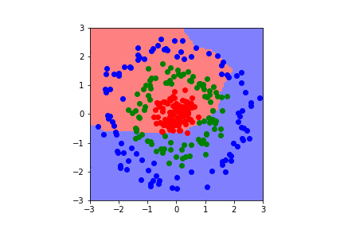

# tiny-nn
A very tiny neural network implementation using only NumPy. For hobby and educational purposes.

### Usage
Python 3 is needed to run the project. It depends on `numpy` and `matplotlib` for plotting. It is advised to use Anaconda, as these libraries are already installed in that Python environment.  
Otherwise run `pip install -r requirements.txt`.

After that run `jupyter notebook` in the checkout directory to view, edit and run `neuralnetwork.ipynb`.  
On GitHub jupyter notebooks are rendered with the output, so if you only want to view it then downloading isn't necessary.

### Sample training process visualized

